---
## Front matter
title: "Отчёт по лабораторной работе №3"
subtitle: "дисциплина: Архитектура компьютера"
author: "Скандарова Полина Юрьевна"

## Generic otions
lang: ru-RU
toc-title: "Содержание"

## Bibliography
bibliography: bib/cite.bib
csl: pandoc/csl/gost-r-7-0-5-2008-numeric.csl

## Pdf output format
toc: true # Table of contents
toc-depth: 2
lof: true # List of figures
lot: true # List of tables
fontsize: 12pt
linestretch: 1.5
papersize: a4
documentclass: scrreprt
## I18n polyglossia
polyglossia-lang:
  name: russian
  options:
	- spelling=modern
	- babelshorthands=true
polyglossia-otherlangs:
  name: english
## I18n babel
babel-lang: russian
babel-otherlangs: english
## Fonts
mainfont: PT Serif
romanfont: PT Serif
sansfont: PT Sans
monofont: PT Mono
mainfontoptions: Ligatures=TeX
romanfontoptions: Ligatures=TeX
sansfontoptions: Ligatures=TeX,Scale=MatchLowercase
monofontoptions: Scale=MatchLowercase,Scale=0.9
## Biblatex
biblatex: true
biblio-style: "gost-numeric"
biblatexoptions:
  - parentracker=true
  - backend=biber
  - hyperref=auto
  - language=auto
  - autolang=other*
  - citestyle=gost-numeric
## Pandoc-crossref LaTeX customization
figureTitle: "Рис."
tableTitle: "Таблица"
listingTitle: "Листинг"
lofTitle: "Список иллюстраций"
lotTitle: "Список таблиц"
lolTitle: "Листинги"
## Misc options
indent: true
header-includes:
  - \usepackage{indentfirst}
  - \usepackage{float} # keep figures where there are in the text
  - \floatplacement{figure}{H} # keep figures where there are in the text
---

# Цель работы

Изучение идеологии и применение средств контроля версий. Приобретение практических навыков по работе с системой git.

# Выполнение лабораторной работы

Существует несколько доступных серверов репозиториев с возможностью
бесплатного размещения данных, для выполнения лабораторных работ я буду использовать Github. Для этого необходимо создать учётную запись на сайте https://github.com/ и заполнить основные данные. (рис. [-@fig:001])

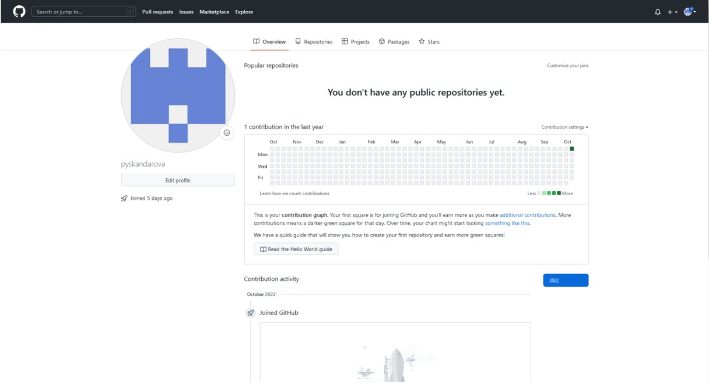{ #fig:001 width=70% }

Сначала необходимо сделать предварительную конфигурацию git. Для этого открываю терминал и ввожу команды, указав имя и email владельца репозитория, после чего настраиваю utf-8 в выводе сообщений git. Также нужно задать имя начальной ветки (у меня master), параметр autocrlf и параметр safecrlf. (рис. [-@fig:002])

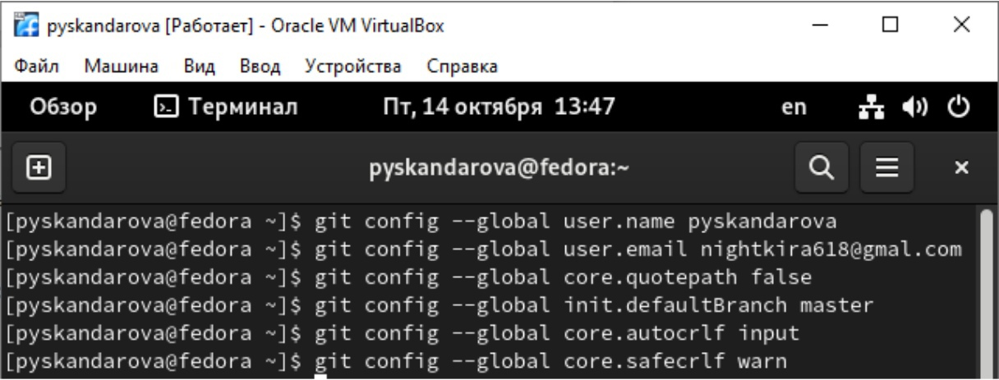{ #fig:002 width=70% }

Для последующей идентификации пользователя на сервере репозиториев необходимо сгенерировать пару ключей (приватный и открытый). (рис. [-@fig:003])

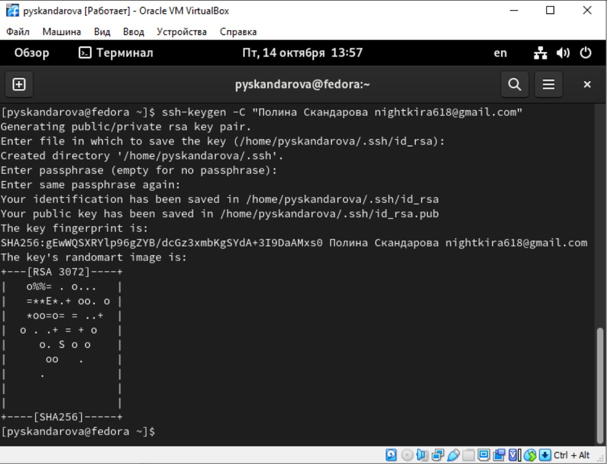{ #fig:003 width=70% }

Далее необходимо загрузить сгенерённый открытый ключ. Для этого нужно скопировать из локальной консоли ключ в буфер обмена, зайти на сайт http://github.org/ под своей учётной записью и перейти в меню Setting . После этого выбрать в боковом меню SSH and GPG keys и нажать кнопку New SSH key. (рис. [-@fig:004])

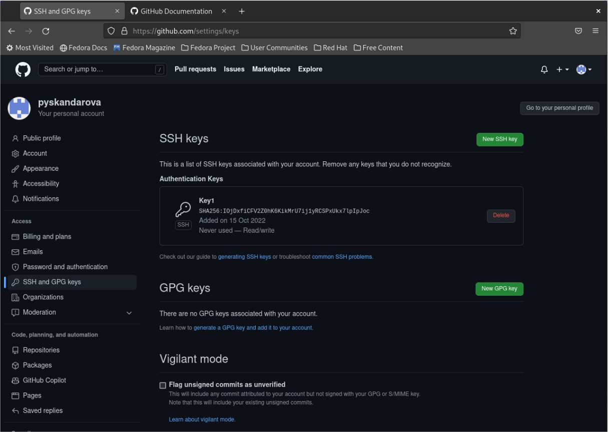{ #fig:004 width=70% }

При выполнении лабораторных работ необходимо придерживаться структуры рабочего пространства. Рабочее пространство по предмету будет располагаться в следующей иерархии: (рис. [-@fig:005])

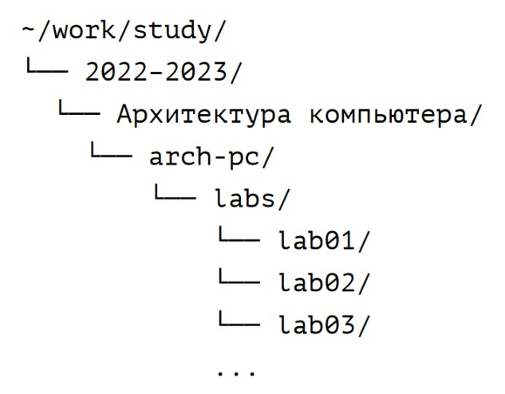{ #fig:005 width=70% }

Для этого нужно открыть терминал и создайте каталог для предмета «Архитектура компьютера». (рис. [-@fig:006])

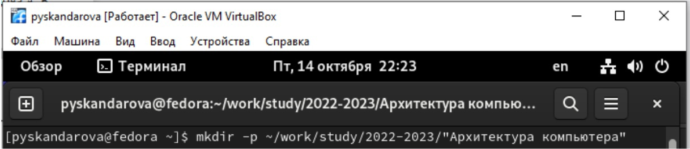{ #fig:006 width=70% }

Репозиторий на основе шаблона можно создать через web-интерфейс github. Для этого нужно перейти на страницу репозитория с шаблоном курса https://github.com/yamadharma/course-directory-student-template, выбрать Use this template. В открывшемся окне задать имя репозитория (Repository name) study_2022–2023_arh-pc и создать репозиторий. (рис. [-@fig:007])

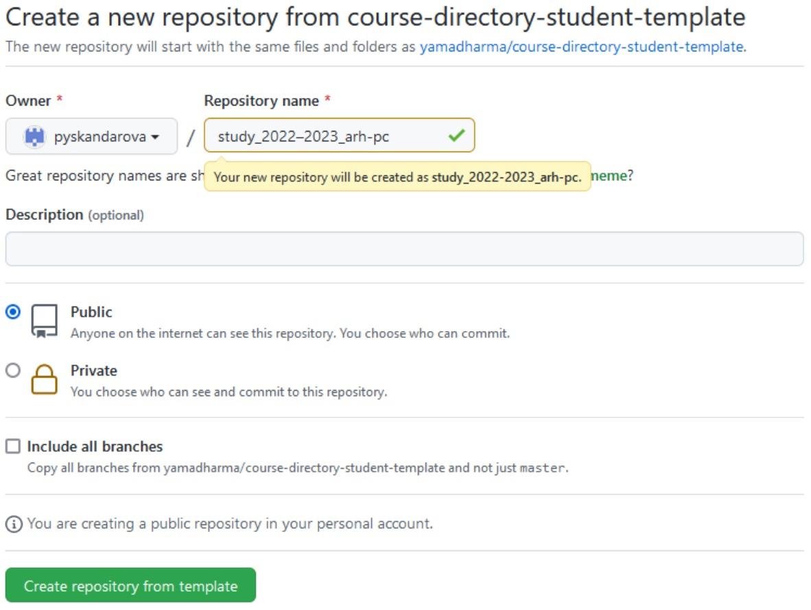{ #fig:007 width=70% }

Далее нужно скопировать ссылку для клонирования на странице созданного репозитория Code -> SSH: (рис. [-@fig:008])

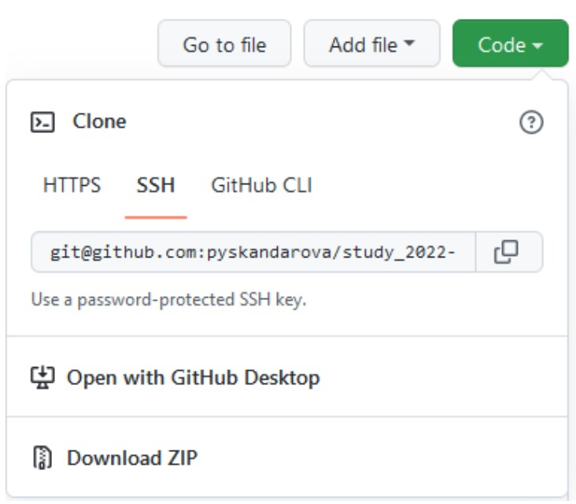{ #fig:008 width=70% }

После чего нужно открыть терминал и перейти в каталог курса, после чего клонировать созданный репозиторий. (рис. [-@fig:009])

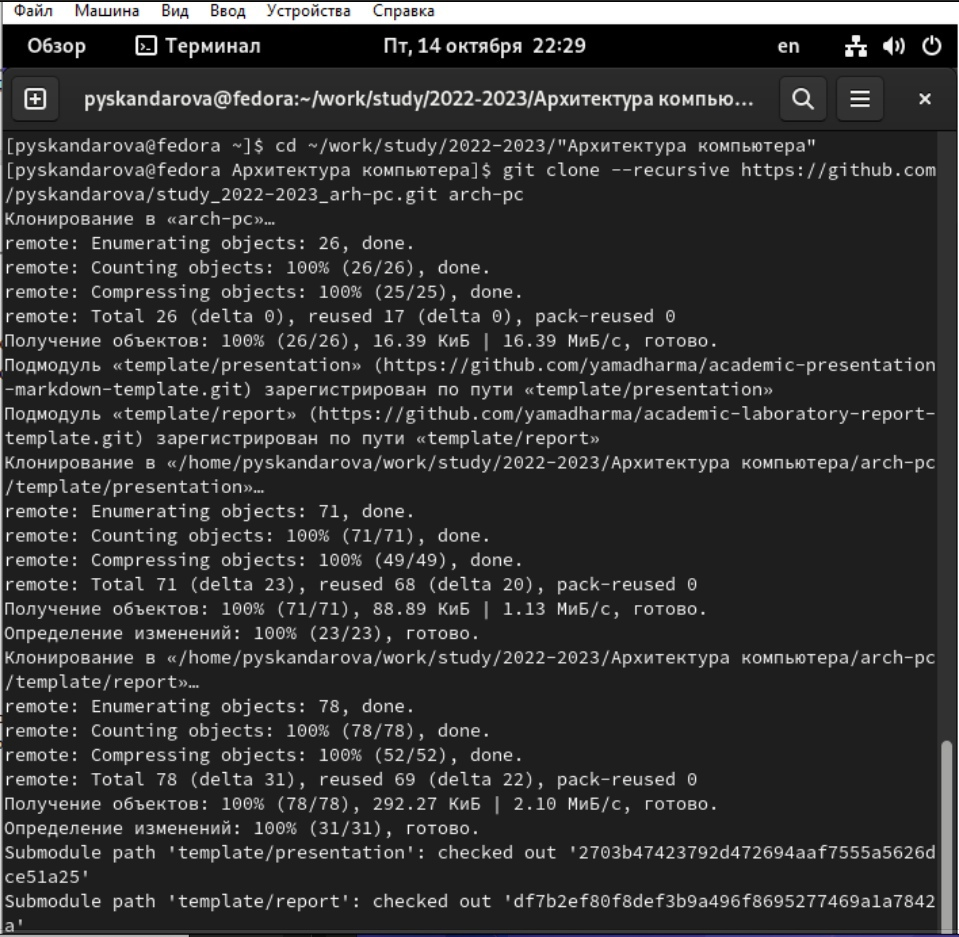{ #fig:009 width=70% }

Для настройки каталога нужно перейти в каталог курса, удалить лишние файлы, создать необходимые каталоги и отправить файлы на сервер. (рис. [-@fig:09])(рис. [-@fig:010])

{ #fig:09 width=70% }

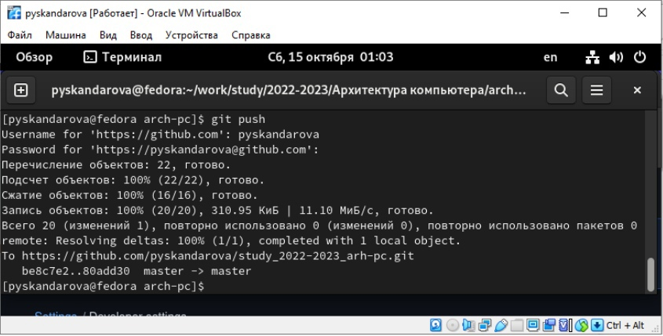{ #fig:010 width=70% }

Описание результатов выполнения заданий для самостоятельной
работы: (рис. [-@fig:011])

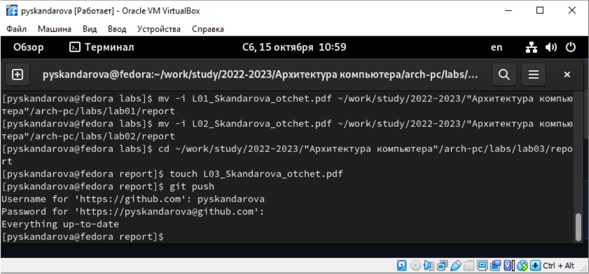{ #fig:011 width=70% }

# Выводы

В ходе лабораторной работы получены практические навыки работы с системой git, изучена идеология и получены навыки применения средства контроля версий.
