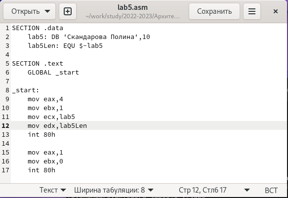

---
## Front matter
title: "Отчёт по лабораторной работе №5"
subtitle: "дисциплина: Архитектура компьютера"
author: "Скандарова Полина Юрьевна"

## Generic otions
lang: ru-RU
toc-title: "Содержание"

## Bibliography
bibliography: bib/cite.bib
csl: pandoc/csl/gost-r-7-0-5-2008-numeric.csl

## Pdf output format
toc: true # Table of contents
toc-depth: 2
lof: true # List of figures
lot: true # List of tables
fontsize: 12pt
linestretch: 1.5
papersize: a4
documentclass: scrreprt
## I18n polyglossia
polyglossia-lang:
  name: russian
  options:
	- spelling=modern
	- babelshorthands=true
polyglossia-otherlangs:
  name: english
## I18n babel
babel-lang: russian
babel-otherlangs: english
## Fonts
mainfont: PT Serif
romanfont: PT Serif
sansfont: PT Sans
monofont: PT Mono
mainfontoptions: Ligatures=TeX
romanfontoptions: Ligatures=TeX
sansfontoptions: Ligatures=TeX,Scale=MatchLowercase
monofontoptions: Scale=MatchLowercase,Scale=0.9
## Biblatex
biblatex: true
biblio-style: "gost-numeric"
biblatexoptions:
  - parentracker=true
  - backend=biber
  - hyperref=auto
  - language=auto
  - autolang=other*
  - citestyle=gost-numeric
## Pandoc-crossref LaTeX customization
figureTitle: "Рис."
tableTitle: "Таблица"
listingTitle: "Листинг"
lofTitle: "Список иллюстраций"
lotTitle: "Список таблиц"
lolTitle: "Листинги"
## Misc options
indent: true
header-includes:
  - \usepackage{indentfirst}
  - \usepackage{float} # keep figures where there are in the text
  - \floatplacement{figure}{H} # keep figures where there are in the text
---

# Цель работы

Освоение процедуры компиляции и сборки программ, написанных на ассемблере NASM.

# Выполнение лабораторной работы

Традиционно первая программа выводит приветственное сообщение Hello world! на экран. Это будет и моей первой программой на языке ассемблера NASM.
Для начала необходимо создать каталог для работы с программами на языке ассемблера NASM, после чего перейти в созданный каталог и создать текстовый файл с именем hello.asm. Этот файл открываю с помощью текстового редактора gedit и ввожу данный в файле лабораторной работы текст.(рис. [-@fig:001])

{ #fig:001 width=70% }

NASM превращает текст программы в объектный код. Для компиляции приведённого выше текста программы «Hello World» необходимо написать команду, и если текст программы набран без ошибок, то транслятор преобразует текст программы из файла hello.asm в объектный код, который запишется в файл hello.o, наличие которого я проверяю командой ls.
Далее выполняю команду, которая должна скомпилировать исходный файл hello.asm в obj.o с форматом выходного файла elf, кроме того, будет создан файл листинга list.lst.
Чтобы получить исполняемую программу, объектный файл необходимо передать на обработку компоновщику, после чего я проверку на создание файла не выполнила, но из результата делаю вывод, что у меня всё получилось.
В приведённой в тексте лабораторной работы команде ld -m elf_i386 obj.o -o main объектный файл имеет имя obj.o, а исполняемый - main.
После всего запускаю исполняемый файл hello.(рис. [-@fig:002])

{ #fig:002 width=70% }

# Выполнение заданий для самостоятельной работы

(рис. [-@fig:003])

{ #fig:003 width=70% }

(рис. [-@fig:004])

{ #fig:004 width=70% }

(рис. [-@fig:005])

{ #fig:005 width=70% }

# Выводы

В ходе лабораторной работы освоена процедура компиляции и сборки программ, написанных на ассемблере NASM.
