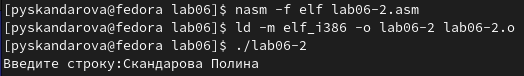

---
## Front matter
title: "Лабораторная работа №6"
subtitle: "Архитектура компьютера"
author: "Скандарова Полина Юрьевна"

## Generic otions
lang: ru-RU
toc-title: "Содержание"

## Bibliography
bibliography: bib/cite.bib
csl: pandoc/csl/gost-r-7-0-5-2008-numeric.csl

## Pdf output format
toc: true # Table of contents
toc-depth: 2
lof: true # List of figures
lot: true # List of tables
fontsize: 12pt
linestretch: 1.5
papersize: a4
documentclass: scrreprt
## I18n polyglossia
polyglossia-lang:
  name: russian
  options:
	- spelling=modern
	- babelshorthands=true
polyglossia-otherlangs:
  name: english
## I18n babel
babel-lang: russian
babel-otherlangs: english
## Fonts
mainfont: PT Serif
romanfont: PT Serif
sansfont: PT Sans
monofont: PT Mono
mainfontoptions: Ligatures=TeX
romanfontoptions: Ligatures=TeX
sansfontoptions: Ligatures=TeX,Scale=MatchLowercase
monofontoptions: Scale=MatchLowercase,Scale=0.9
## Biblatex
biblatex: true
biblio-style: "gost-numeric"
biblatexoptions:
  - parentracker=true
  - backend=biber
  - hyperref=auto
  - language=auto
  - autolang=other*
  - citestyle=gost-numeric
## Pandoc-crossref LaTeX customization
figureTitle: "Рис."
tableTitle: "Таблица"
listingTitle: "Листинг"
lofTitle: "Список иллюстраций"
lotTitle: "Список таблиц"
lolTitle: "Листинги"
## Misc options
indent: true
header-includes:
  - \usepackage{indentfirst}
  - \usepackage{float} # keep figures where there are in the text
  - \floatplacement{figure}{H} # keep figures where there are in the text
---

# Цель работы

Приобретение практических навыков работы в Midnight Commander. Освоение инструкций языка ассемблера mov и int.

# Выполнение лабораторной работы

Для начала необходимо открыть Midnight Commander. (рис. [-@fig:001])

{ #fig:001 width=70% }

Дальше, пользуясь клавишами "вверх" , "вниз" и Enter перейти в каталог ~/work/arch-pc созданный при выполнении лабораторной работы №5 и с помощью функциональной клавиши F7 создать папку lab06.(рис. [-@fig:002])

{ #fig:002 width=70% }

Перейдя в созданный каталог и пользуясь строкой ввода и командой touch создаю файл lab6-1.asm. (рис. [-@fig:003])

{ #fig:003 width=70% }

Теперь помощью функциональной клавиши F4 открываю файл lab6-1.asm для редактирования во встроенном редакторе. В качестве встроенного редактора Midnight Commander использую редактор mcedit.(рис. [-@fig:004])

{ #fig:004 width=70% }

Ввожу текст программы из листинга без комментариев, сохраняю изменения и закрываю файл. Теперь надо оттранслировать текст программы lab6-1.asm в объектный файл. Выполняю компоновку объектного файла и запускаю получившийся исполняемый файл. Программа выводит строку 'Введите строку:' и ожидает ввода с клавиатуры. На запрос ввожу мои ФИО.(рис. [-@fig:005])

{ #fig:005 width=70% }

Скачиваю файл in_out.asm со страницы курса в ТУИС и копирую его в тот же каталог, где и файл с программой, в которой он используется.(рис. [-@fig:006])

{ #fig:006 width=70% }

С помощью функциональной клавиши F6 создаю копию файла lab6-1.asm с именем lab6-2.asm. Выделяю файл lab6-1.asm, нажав клавишу F6, ввожу имя файла lab6-2.asm и жму клавишу Enter.(рис. [-@fig:007])

{ #fig:007 width=70% }

Исправляю текст программы в файле lab6-2.asm с использованием подпрограмм из внешнего файла in_out.asm в соответствии с листингом. Создаю исполняемый файл и проверяю его работу. (рис. [-@fig:008]) (рис. [-@fig:009])

{ #fig:008 width=70% }

{ #fig:009 width=70% }

В файле lab6-2.asm заменяю подпрограмму sprintLF на sprint. Создаю исполняемый файл и проверяю его работу. Разница в том, что теперь ввод происходит на той же строчке.

(рис. [-@fig:010])

{ #fig:010 width=70% }

# Задание для самостоятельной работы

Создаю копию файла lab6-1.asm и вношу изменения в программу (без
использования внешнего файла in_out.asm), так чтобы она повторяла введённую строку.(рис. [-@fig:011])

{ #fig:011 width=70% }

Получаю исполняемый файл и проверяю его работу. На приглашение ввести строку ввожу свою фамилию.(рис. [-@fig:012])

{ #fig:012 width=70% }

Создаю копию файла lab6-2.asm. Исправляю текст программы с использованием подпрограмм из внешнего файла in_out.asm, так чтобы она повторяла введённую строку.(рис. [-@fig:013])

{ #fig:013 width=70% }

Создаю исполняемый файл и проверяю его работу.(рис. [-@fig:014])

{ #fig:014 width=70% }

# Выводы

В ходе лабораторной работы приобретены практические навыков работы в Midnight Commander и освоены инструкции языка ассемблера mov и int.
