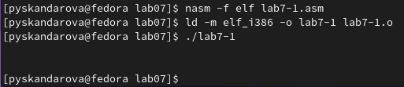

---
## Front matter
title: "Лабораторная работа №7"
subtitle: "Архитектура компьютеров"
author: "Скандарова Полина Юрьевна"

## Generic otions
lang: ru-RU
toc-title: "Содержание"

## Bibliography
bibliography: bib/cite.bib
csl: pandoc/csl/gost-r-7-0-5-2008-numeric.csl

## Pdf output format
toc: true # Table of contents
toc-depth: 2
lof: true # List of figures
lot: true # List of tables
fontsize: 12pt
linestretch: 1.5
papersize: a4
documentclass: scrreprt
## I18n polyglossia
polyglossia-lang:
  name: russian
  options:
	- spelling=modern
	- babelshorthands=true
polyglossia-otherlangs:
  name: english
## I18n babel
babel-lang: russian
babel-otherlangs: english
## Fonts
mainfont: PT Serif
romanfont: PT Serif
sansfont: PT Sans
monofont: PT Mono
mainfontoptions: Ligatures=TeX
romanfontoptions: Ligatures=TeX
sansfontoptions: Ligatures=TeX,Scale=MatchLowercase
monofontoptions: Scale=MatchLowercase,Scale=0.9
## Biblatex
biblatex: true
biblio-style: "gost-numeric"
biblatexoptions:
  - parentracker=true
  - backend=biber
  - hyperref=auto
  - language=auto
  - autolang=other*
  - citestyle=gost-numeric
## Pandoc-crossref LaTeX customization
figureTitle: "Рис."
tableTitle: "Таблица"
listingTitle: "Листинг"
lofTitle: "Список иллюстраций"
lotTitle: "Список таблиц"
lolTitle: "Листинги"
## Misc options
indent: true
header-includes:
  - \usepackage{indentfirst}
  - \usepackage{float} # keep figures where there are in the text
  - \floatplacement{figure}{H} # keep figures where there are in the text
---

# Цель работы

Освоение арифметических инструкций языка ассемблера NASM.

# Выполнение лабораторной работы

Для начала необходимо создать каталог для программам лабораторной работы №7, перейдти в него и создать файл lab7-1.asm (рис. [-@fig:001])

{ #fig:001 width=70% }

Ввожу в файл lab7-1.asm текст программы из листинга 7.1 (рис. [-@fig:002])

{ #fig:002 width=70% }

Создаю исполняемый файл и запускаю его, получая вместо ожидаемой 10 символ 'j' из-за кодов символов (рис. [-@fig:003])

{ #fig:003 width=70% }

Далее изменяю текст программы и вместо символов, записываю в регистры числа. (рис. [-@fig:004])

{ #fig:004 width=70% }

Теперь выводится символ с кодом 10 - перенос строки.(рис. [-@fig:005])

{ #fig:005 width=70% }

Создаю файл lab7-2.asm в каталоге ~/work/arch-pc/lab07 и ввожу в него текст программы из листинга 7.2 (рис. [-@fig:006])

{ #fig:006 width=70% }

В результате работы программы получаю число 106, сумму кодов символов '6' и '4' (рис. [-@fig:007])

{ #fig:007 width=70% }

Аналогично предыдущему примеру изменяю символы на числа (рис. [-@fig:008])

{ #fig:008 width=70% }

В этот раз программа наконец выводит число 10 (рис. [-@fig:009])

{ #fig:009 width=70% }

Если заменить iprintLF на iprint, то следующая строка в терминале открывается на той же строке, что и результат (рис. [-@fig:010])

{ #fig:010 width=70% }

# Выполнение арифметических операций в NASM

В качестве примера выполнения арифметических операций в NASM приведу программу вычисления арифметического выражения f(x)=(5*2+3)/3. Создаю файл lab7-3.asm в каталоге ~/work/arch-pc/lab07 и записываю в него программу из листинга (рис. [-@fig:011])

{ #fig:011 width=70% }

Создаю исполняемый файл и запускаю его (рис. [-@fig:012])

{ #fig:012 width=70% }

Изменяю текст программы для вычисления выражения f(x)=(4*6+2)/5(рис. [-@fig:013])

{ #fig:013 width=70% }

И запускаю её (рис. [-@fig:014])

{ #fig:014 width=70% }

Дальше создаю файл variant.asm в каталоге ~/work/arch-pc/lab07 и записываю туда текст листинга, отвечая на вопросы лабораторной в комментариях в самой программе (рис. [-@fig:015])

{ #fig:015 width=70% }

И запускаю программу (рис. [-@fig:016])

{ #fig:016 width=70% }

# Задание для самостоятельной работы

Мой вариант - 16, и я беру для программы формулу (10x−5)^2 (рис. [-@fig:017])

{ #fig:017 width=70% }

И запускаю программу (рис. [-@fig:018])

{ #fig:018 width=70% }

# Выводы

В результате проделанной работы освоены арифметические инструкции языка ассемблера NASM.
