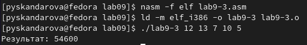

---
## Front matter
title: "Лабораторная работа №9"
subtitle: "Архитектура компьютеров"
author: "Скандарова Полина Юрьевна"

## Generic otions
lang: ru-RU
toc-title: "Содержание"

## Bibliography
bibliography: bib/cite.bib
csl: pandoc/csl/gost-r-7-0-5-2008-numeric.csl

## Pdf output format
toc: true # Table of contents
toc-depth: 2
lof: true # List of figures
lot: true # List of tables
fontsize: 12pt
linestretch: 1.5
papersize: a4
documentclass: scrreprt
## I18n polyglossia
polyglossia-lang:
  name: russian
  options:
	- spelling=modern
	- babelshorthands=true
polyglossia-otherlangs:
  name: english
## I18n babel
babel-lang: russian
babel-otherlangs: english
## Fonts
mainfont: PT Serif
romanfont: PT Serif
sansfont: PT Sans
monofont: PT Mono
mainfontoptions: Ligatures=TeX
romanfontoptions: Ligatures=TeX
sansfontoptions: Ligatures=TeX,Scale=MatchLowercase
monofontoptions: Scale=MatchLowercase,Scale=0.9
## Biblatex
biblatex: true
biblio-style: "gost-numeric"
biblatexoptions:
  - parentracker=true
  - backend=biber
  - hyperref=auto
  - language=auto
  - autolang=other*
  - citestyle=gost-numeric
## Pandoc-crossref LaTeX customization
figureTitle: "Рис."
tableTitle: "Таблица"
listingTitle: "Листинг"
lofTitle: "Список иллюстраций"
lotTitle: "Список таблиц"
lolTitle: "Листинги"
## Misc options
indent: true
header-includes:
  - \usepackage{indentfirst}
  - \usepackage{float} # keep figures where there are in the text
  - \floatplacement{figure}{H} # keep figures where there are in the text
---

# Цель работы

Приобретение навыков написания программ с использованием циклов и
обработкой аргументов командной строки.

# Выполнение лабораторной работы

Для начала необходимо создать каталог для программ лабораторной работы №9, перейти в
него и создать файл lab9-1.asm. Потом нужно внимательно изучить текст программы в листинге и перенести его в файл. (рис. [-@fig:001])

{ #fig:001 width=70% }

Программа пишет числа от введённого до одного.(рис. [-@fig:002])

{ #fig:002 width=70% }

Изменив программу, добавив изменение значения регистра ecx в цикле.(рис. [-@fig:003])

{ #fig:003 width=70% }

Получаю огромное количество проходов цикла, не соответствующее введённому числу. Для использования регистра ecx в цикле и сохранения корректности работы вношу изменения в текст программы добавив команды push и pop (добавления в стек и извлечения из стека) для сохранения значения счетчика цикла loop. (рис. [-@fig:004])

{ #fig:004 width=70% }

Теперь программа выводит числа от введённого минус один до нуля. Число проходов введённому числу соответствует. (рис. [-@fig:005])

{ #fig:005 width=70% }

Теперь нужно внимательно изучить текст программы листинга и ввести его в файл lab9-2.asm. (рис. [-@fig:006])

{ #fig:006 width=70% }

Создаю исполняемый файл и запускаю его, указав предложенные аргументы. (рис. [-@fig:007])

{ #fig:007 width=70% }

Обработано программой было четыре аргумента. Дальше создаю файл lab9-3.asm и ввожу в него текст программы из листинга. (рис. [-@fig:008])

{ #fig:008 width=70% }

Создаю исполняемый файл и запускаю его, указав аргументы. (рис. [-@fig:009])

{ #fig:009 width=70% }

Изменяю текст программы из листинга для вычисления произведения аргументов командной строки.(рис. [-@fig:010])

{ #fig:010 width=70% }

И запускаю программу. (рис. [-@fig:011])

{ #fig:011 width=70% }

# Задание для самостоятельной работы

Необходимо написать программу, которая находит сумму значений функции 30x-11 для всех заданных аргументов.(рис. [-@fig:012])(рис. [-@fig:013])

{ #fig:012 width=70% }

{ #fig:013 width=70% }

# Выводы

В ходе выполнения лабораторной работы приобретены навыки написания программ с использованием циклов и
обработкой аргументов командной строки.
