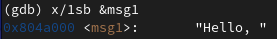
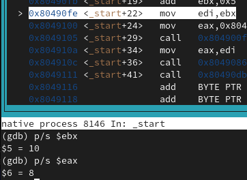

---
## Front matter
title: "Лабораторная работа №10"
subtitle: "Архитектура компьютера"
author: "Скандарова Полина Юрьевна"

## Generic otions
lang: ru-RU
toc-title: "Содержание"

## Bibliography
bibliography: bib/cite.bib
csl: pandoc/csl/gost-r-7-0-5-2008-numeric.csl

## Pdf output format
toc: true # Table of contents
toc-depth: 2
lof: true # List of figures
lot: true # List of tables
fontsize: 12pt
linestretch: 1.5
papersize: a4
documentclass: scrreprt
## I18n polyglossia
polyglossia-lang:
  name: russian
  options:
	- spelling=modern
	- babelshorthands=true
polyglossia-otherlangs:
  name: english
## I18n babel
babel-lang: russian
babel-otherlangs: english
## Fonts
mainfont: PT Serif
romanfont: PT Serif
sansfont: PT Sans
monofont: PT Mono
mainfontoptions: Ligatures=TeX
romanfontoptions: Ligatures=TeX
sansfontoptions: Ligatures=TeX,Scale=MatchLowercase
monofontoptions: Scale=MatchLowercase,Scale=0.9
## Biblatex
biblatex: true
biblio-style: "gost-numeric"
biblatexoptions:
  - parentracker=true
  - backend=biber
  - hyperref=auto
  - language=auto
  - autolang=other*
  - citestyle=gost-numeric
## Pandoc-crossref LaTeX customization
figureTitle: "Рис."
tableTitle: "Таблица"
listingTitle: "Листинг"
lofTitle: "Список иллюстраций"
lotTitle: "Список таблиц"
lolTitle: "Листинги"
## Misc options
indent: true
header-includes:
  - \usepackage{indentfirst}
  - \usepackage{float} # keep figures where there are in the text
  - \floatplacement{figure}{H} # keep figures where there are in the text
---

# Цель работы

Приобретение навыков написания программ с использованием подпрограмм. Знакомство с методами отладки при помощи GDB и его основными возможностями.

# Выполнение лабораторной работы

Для начала необходимо создать каталог для выполнения лабораторной работы №10, перейти в него и создать файл lab10-1.asm. В качестве примера рассматривается программа вычисления арифметического выражения f(x) = 2x + 7 с помощью подпрограммы _calcul. В данном примере x вводится с клавиатуры, а само выражение вычисляется в подпрограмме. Внимательно изучаю текст программы и ввожу её в файл. (рис. [-@fig:001])

{ #fig:001 width=70% }

Создаю исполняемый файл и проверяю его работу. (рис. [-@fig:002])

{ #fig:002 width=70% }

Изменяю текст программы, добавив подпрограмму _subcalcul в подпрограмму _calcul, для вычисления выражения f(g(x)), где x вводится с клавиатуры, f(x) = 2x + 7, g(x) = 3x − 1. (рис. [-@fig:003])

{ #fig:003 width=70% }

После чего её проверяю. (рис. [-@fig:004])

{ #fig:004 width=70% }

Дальше создаю файл lab10-2.asm с текстом программы из листинга. (Программа печати сообщения Hello world!). (рис. [-@fig:005])

{ #fig:005 width=70% }

Получаю исполняемый файл. Для работы с GDB в исполняемый файл необходимо добавить отладочную информацию, для этого трансляцию программ необходимо проводить с ключом ‘-g’. Потом загружаю исполняемый файл в отладчик gdb и проверяю работу программы, запустив ее в оболочке GDB с помощью команды run (сокращённо r).(рис. [-@fig:006])

{ #fig:006 width=70% }

Для более подробного анализа программы устанавливаю брейкпоинт на метку _start, с которой начинается выполнение любой ассемблерной программы, и запускаю её.(рис. [-@fig:007])

{ #fig:007 width=70% }

Теперь смотрю дисассимилированный код программы с помощью команды disassemble начиная с метки _start. (рис. [-@fig:008])

{ #fig:008 width=70% }

Переключаюсь на отображение команд с Intel’овским синтаксисом, введя команду set disassembly-flavor intel. Разница синтаксиса машинных команд в режимах ATT и Intel в том, что в АТТ перед всеми значениями и адресами стоять символы $, а перед регистрами - %, также в АТТ во всех командах mov аргументы стоят в обратном порядке. (рис. [-@fig:009])

{ #fig:009 width=70% }

Далее включаю режим псевдографики для более удобного анализа программы. (рис. [-@fig:010])

{ #fig:010 width=70% }

На предыдущих шагах была установлена точка останова по имени метки (_start). Проверяю это с помощью команды info breakpoints (кратко i b). (рис. [-@fig:011])

{ #fig:011 width=70% }

Устанавливаю еще одну точку останова по адресу инструкции. Адрес инструкции можно увидеть в средней части экрана в левом столбце соответствующей инструкции. Определяю адрес предпоследней инструкции (mov ebx,0x0) и устаноавливаю точку останова.(рис. [-@fig:012])

{ #fig:012 width=70% }

Посмотреть содержимое регистров можно с помощью команды info registers (или i r). (рис. [-@fig:013])

{ #fig:013 width=70% }

С помощью команды x &<имя переменной> можно посмотреть содержимое переменной. Я смотрю значение переменной msg1 по имени. (рис. [-@fig:014])

{ #fig:014 width=70% }

Значение переменной msg2 смотрю по адресу. (рис. [-@fig:015])

{ #fig:015 width=70% }

Изменить значение для регистра или ячейки памяти можно с помощью команды set, задав ей в качестве аргумента имя регистра или адрес. При этом перед именем регистра ставится префикс $, а перед адресом нужно указать в фигурных скобках тип данных (размер сохраняемого значения; в качестве типа данных можно использовать типы языка Си). Я изменяю первый символ переменной msg1. (рис. [-@fig:016])

{ #fig:016 width=70% }

Замените любой символ во второй переменной msg2.(рис. [-@fig:017])

{ #fig:017 width=70% }

Вывожу в различных форматах (в шестнадцатеричном формате, в двоичном формате и в символьном виде) значение регистра edx. (рис. [-@fig:018])

{ #fig:018 width=70% }

С помощью команды set изменяю значение регистра ebx. (рис. [-@fig:019])

{ #fig:019 width=70% }

В первый раз в регистре находится символ '2' и программа выводит его код, во второй - значение 2.
Завершаю выполнение программы с помощью команды continue (сокращенно c) или stepi (сокращенно si) и выхожу из GDB с помощью команды quit (сокращенно q). (рис. [-@fig:020])

{ #fig:020 width=70% }

Копирую файл lab9-2.asm, созданный при выполнении лабораторной работы №9, с программой выводящей на экран аргументы командной строки в файл с именем lab10-3.asm и создаю исполняемый файл. Для загрузки в gdb программы с аргументами необходимо использовать ключ --args. Загружаю исполняемый файл в отладчик, указав аргументы. (рис. [-@fig:021])

{ #fig:021 width=70% }

Как отмечалось в предыдущей лабораторной работе, при запуске программы аргументы командной строки загружаются в стек. Исследую расположение аргументов командной строки в стеке после запуска программы с помощью gdb для начала установив точку останова перед первой инструкцией в программе и запустив ее. (рис. [-@fig:022])

{ #fig:022 width=70% }

Адрес вершины стека храниться в регистре esp и по этому адресу располагается число равное количеству аргументов командной строки (включая имя программы). Смотрите остальные позиции стека – по адесу [esp+4] располагается адрес в памяти где находиться имя программы, по адесу [esp+8] храниться адрес первого аргумента, по аресу [esp+12] – второго и т.д.(рис. [-@fig:023])

{ #fig:023 width=70% }

Шаг равен 4, так как каждый адрес занимает 4 байта.

# Задание для самостоятельной работы

1. Преобразую программу из лабораторной работы №9 (Задание №1 для самостоятельной работы), реализовав вычисление значения функции f(x) как подпрограмму. (рис. [-@fig:024])

{ #fig:024 width=70% }

И проверяю её работу. (рис. [-@fig:025])

{ #fig:025 width=70% }

2. В листинге приведена программа вычисления выражения (3 + 2) * 4 + 5. При запуске данная программа дает неверный результат. Проверяю это и с помощью отладчика GDB, анализируя изменения значений регистров, определяю ошибку и исправляю ее.(рис. [-@fig:026]) 

{ #fig:026 width=70% }

Результат сложения оказывается не в том регистре и не участвует в умножении, сложение и вывод происходят с регистром, где умножения не происходило. (рис. [-@fig:027]) (рис. [-@fig:028])

{ #fig:027 width=70% }

{ #fig:028 width=70% }

Исправляю программу.(рис. [-@fig:029]) 

{ #fig:029 width=70% }

Теперь вывод корректен. (рис. [-@fig:030]) 

{ #fig:030 width=70% }

# Выводы

В ходе выполнения лабораторной работы приобретены навыков написания программ с использованием подпрограмм. Знакомство с методами отладки при помощи GDB и его основными возможностями прошло успешно.
