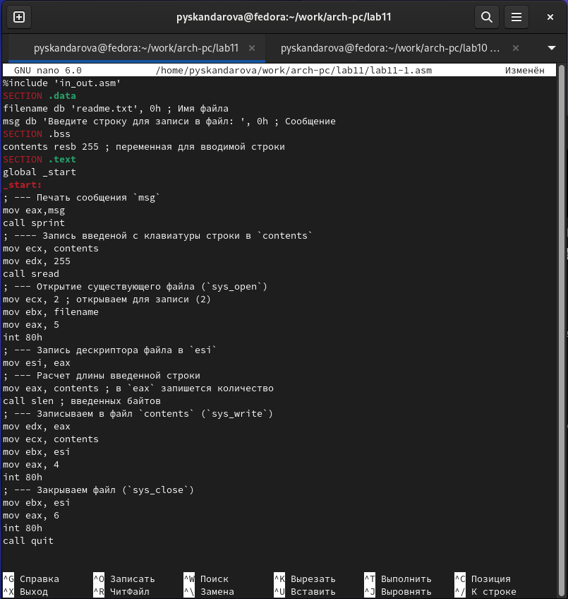
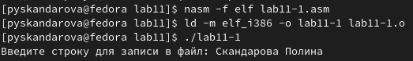
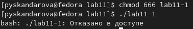
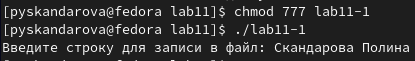
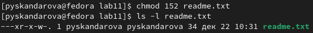
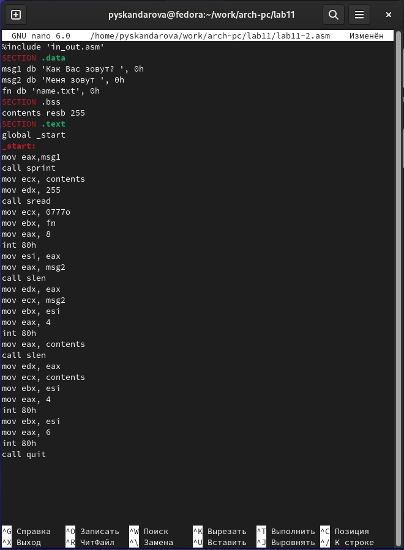
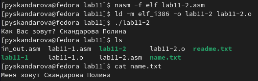

---
## Front matter
title: "Лабораторная работа №11"
subtitle: "Архитектура компьютера"
author: "Скандарова Полина Юрьевна"

## Generic otions
lang: ru-RU
toc-title: "Содержание"

## Bibliography
bibliography: bib/cite.bib
csl: pandoc/csl/gost-r-7-0-5-2008-numeric.csl

## Pdf output format
toc: true # Table of contents
toc-depth: 2
lof: true # List of figures
lot: true # List of tables
fontsize: 12pt
linestretch: 1.5
papersize: a4
documentclass: scrreprt
## I18n polyglossia
polyglossia-lang:
  name: russian
  options:
	- spelling=modern
	- babelshorthands=true
polyglossia-otherlangs:
  name: english
## I18n babel
babel-lang: russian
babel-otherlangs: english
## Fonts
mainfont: PT Serif
romanfont: PT Serif
sansfont: PT Sans
monofont: PT Mono
mainfontoptions: Ligatures=TeX
romanfontoptions: Ligatures=TeX
sansfontoptions: Ligatures=TeX,Scale=MatchLowercase
monofontoptions: Scale=MatchLowercase,Scale=0.9
## Biblatex
biblatex: true
biblio-style: "gost-numeric"
biblatexoptions:
  - parentracker=true
  - backend=biber
  - hyperref=auto
  - language=auto
  - autolang=other*
  - citestyle=gost-numeric
## Pandoc-crossref LaTeX customization
figureTitle: "Рис."
tableTitle: "Таблица"
listingTitle: "Листинг"
lofTitle: "Список иллюстраций"
lotTitle: "Список таблиц"
lolTitle: "Листинги"
## Misc options
indent: true
header-includes:
  - \usepackage{indentfirst}
  - \usepackage{float} # keep figures where there are in the text
  - \floatplacement{figure}{H} # keep figures where there are in the text
---

# Цель работы

Приобретение навыков написания программ для работы с файлами.

# Выполнение лабораторной работы

Для начала необходимо создать каталог для программ лабораторной работы №11, перейти в него и создать файлы. lab11-1.asm и readme.txt. Дальше - ввести в файл lab11-1.asm текст программы из листинга. (рис. [-@fig:001])

{ #fig:001 width=70% }

Создать исполняемый файл и проверить его работу (рис. [-@fig:002])

{ #fig:002 width=70% }

С помощью команды chmod изменяю права доступа к исполняемому файлу lab11-1, запретив его выполнение и пытаюсь выполнить файл. (рис. [-@fig:003])

{ #fig:003 width=70% }

Теперь с помощью команды chmod изменяю права доступа к файлу lab11-1.asm с исходным текстом программы, добавив права на исполнение. (рис. [-@fig:004])

{ #fig:004 width=70% }

Дальше предоставляю права доступа к файлу readme.txt в соответствии с вариантом в таблице и проверяю правильность выполнения с помощью команды ls -l. (рис. [-@fig:005])

{ #fig:005 width=70% }

# Задание для самостоятельной работы

Пишу программу работающую по следующему алгоритму:
• Вывод приглашения “Как Вас зовут?”
• ввести с клавиатуры свои фамилию и имя
• создать файл с именем name.txt
• записать в файл сообщение “Меня зовут”
• дописать в файл строку введенную с клавиатуры
• закрыть файл

(рис. [-@fig:006])

{ #fig:006 width=70% }

Создаю исполняемый файл и проверяю его работу. Проверяю наличие файла и его содержимое с помощью команд ls и cat.(рис. [-@fig:007])

{ #fig:007 width=70% }

# Выводы

В ходе выполнения лабораторной работы приобретены навыки написания программ для работы с файлами.

